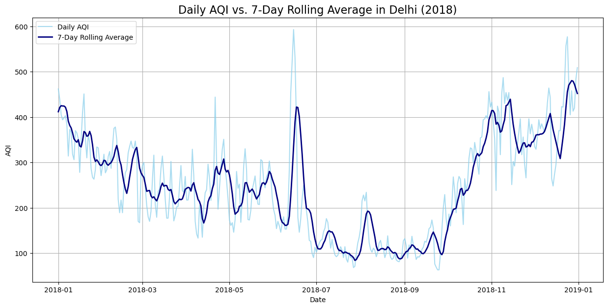
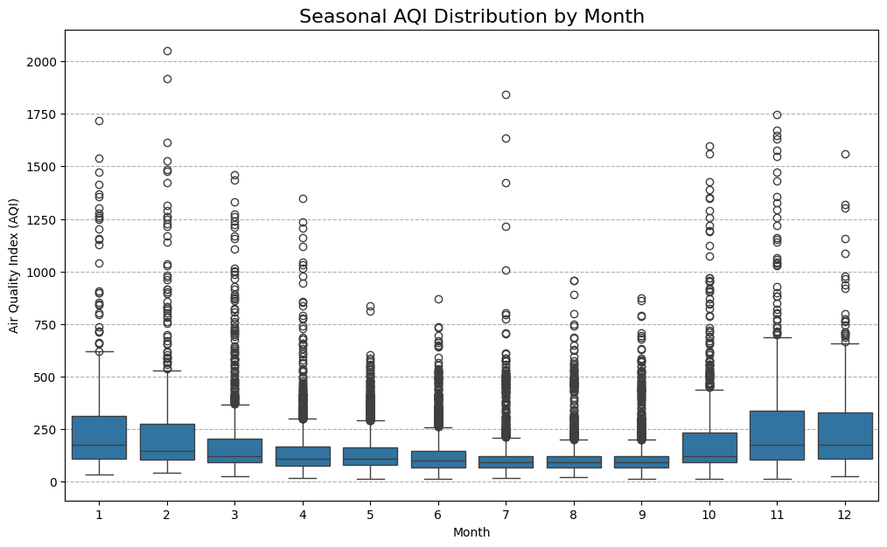
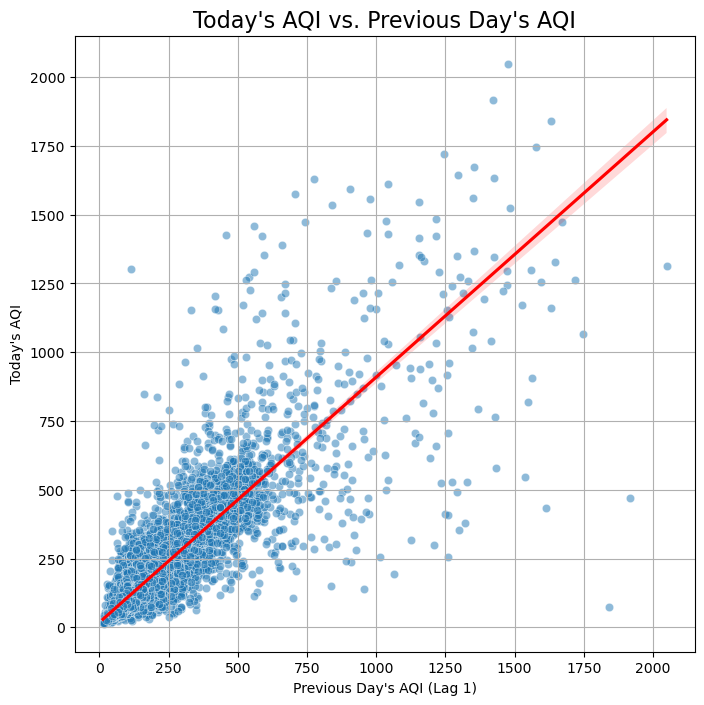
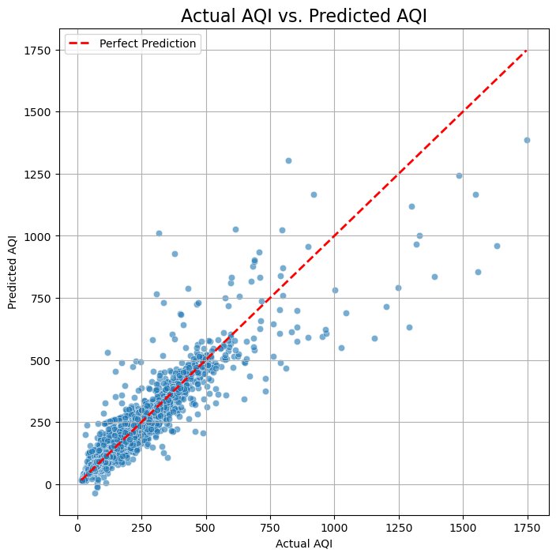

# 🌬️ Air Quality Index (AQI) Prediction for Indian Cities

This project develops a machine learning model to predict the daily Air Quality Index (AQI) in various cities across India. The entire workflow—from data cleaning and feature engineering to model training and deployment with a Streamlit web app—is covered.

---

## 📊 Dataset

The project utilizes the Air Quality Data in India (2015-2020) dataset, which contains daily air quality measurements for 26 cities.  
**Source:** Central Pollution Control Board (CPCB) of India  
**Key Columns:** `Date`, `City`, `AQI` (target), and various pollutant levels such as `PM2.5`, `PM10`, `NO2`, etc.

---

## ⚙️ Project Workflow & Methodology

The project follows a structured machine learning workflow to ensure a robust and accurate model.

### 1. Data Cleaning

- **Linear Interpolation:** Missing values filled by interpolating between existing data points (ideal for time-series).
- **City-wise Mean Imputation:** Remaining nulls (mostly at the start of each city's data) filled with the mean value for that city.

### 2. Feature Engineering

- **Time-Based Features:** Extracted `Month` and `Year` from `Date` to capture seasonal and long-term trends.
- **Lag Features:** Added previous day's AQI (`AQI_lag_1`) and lagged PM2.5.
- **Rolling Averages:** 7-day rolling averages for AQI and PM2.5 to smooth daily fluctuations.
- **Categorical Encoding:** Converted `City` to a numerical feature using Target Guided Encoding (average AQI per city).

## 📊 Key Visualizations

### 1. Daily AQI vs. 7-Day Rolling Average (Delhi, 2018)
This plot compares the **daily AQI values** with their **7-day rolling average** for better trend visualization.



---

### 2. Seasonal AQI Distribution by Month
A box plot showing how AQI varies across months, highlighting **seasonal pollution patterns** (e.g., winter smog).



---

### 3. Today's AQI vs. Previous Day's AQI
Scatter plot showing the correlation between **yesterday’s AQI (lag-1)** and **today’s AQI**, with a regression line showing the trend.



---

### 4. Actual vs. Predicted AQI
Scatter plot comparing the **model’s predictions** with actual AQI values on the test set.  
The closer the points are to the **red dashed line (perfect prediction)**, the more accurate the model.




---

## 🤖 Model Training and Performance

A `LinearRegression` model from scikit-learn was trained on the cleaned and feature-engineered dataset. Features were scaled using `StandardScaler`.

**Performance on test data:**
- **R-squared (R²):** 0.87  
  Explains 87% of the variance in AQI—very good fit.
- **Mean Absolute Error (MAE):** 21.83  
  On average, predictions are off by ~22 AQI points.

---

## 🚀 How to Run the Project

### 1. Prerequisites

- Python 3.7+
- (Recommended) A virtual environment

### 2. Installation

Clone the repository and install dependencies:

```sh
git clone <your-repo-link>
cd <your-repo-folder>
pip install -r requirements.txt
```

### 3. Model Training

To retrain the model or explore the data, run the Jupyter Notebook. This will generate `model.pkl`, `encoder.pkl`, and `scaler.pkl` files.

- File: `notebooks/model_train.ipynb`

### 4. Launch the Web App

Once the model files are saved, run the Streamlit application:

- File: `app.py`

```sh
streamlit run app.py
```

This will launch the interactive AQI predictor in your web browser.

---

## 📁 Project Structure

- `data/` — Raw and processed datasets
- `notebooks/` — Jupyter notebooks for cleaning, EDA, feature engineering, and model training
- `models/` — Saved model, encoder, and scaler files
- `images/` — Visualizations for EDA and model evaluation
- `app.py` — Streamlit web application
- `requirements.txt` — Python dependencies

---

## 📬 Contact

For questions or suggestions, please open an issue or contact the project maintainer.